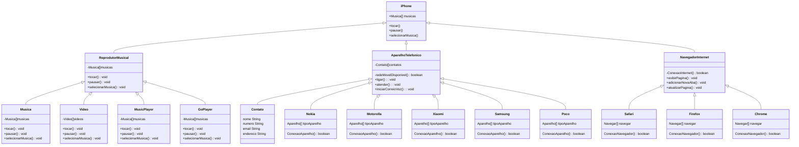

# dio-diagramacao-classes-iphone
DIO Desafio Diagramação de Classes do iPhone

### Diagrama UML (Mermaid)

```mermaid
classDiagram
    iPhone <|-- ReprodutorMusical
    iPhone <|-- Aparelho Telefonico
    iPhone <|-- NavegadorInternet
    iPhone : +Musica[] musicas
    
    iPhone: +tocar()
    iPhone: +pausar()
    iPhone: +selecionarMusica()
    ReprodutorMusical <|-- Musica
    ReprodutorMusical <|-- Video
    ReprodutorMusical <|-- MusicPlayer
    ReprodutorMusical <|-- GoPlayer
    AparelhoTelefonico <|-- Contato
    AparelhoTelefonico <|-- Nokia
    AparelhoTelefonico <|-- Motorolla
    AparelhoTelefonico <|-- Xiaomi
    AparelhoTelefonico <|-- Samsung
    AparelhoTelefonico <|-- Poco
    NavegadorInternet <|-- Safari
    NavegadorInternet <|-- Firefox
    NavegadorInternet <|-- Chrome
    class ReprodutorMusical{
      -Musica[]musicas
      +tocar() void
      +pausar() void
      +selecionarMusica() void
    }
    class AparelhoTelefonico{
      -Contato[]contatos
      -redeMovelDisponivel() boolean
      +ligar(): void
      +atender(): void
      +iniciarCorreioVoz(): void
    }
    class NavegadorInternet{
      -ConexaoInternet() boolean
      +exibirPagina() void
      +adicionarNovaAba() void
      +atualizarPagina() void
    }
    class Nokia{
        Aparelho[] tipoAparelho
        ConexaoAparelho() boolean
    }
    class Motorolla{
        Aparelho[] tipoAparelho
        ConexaoAparelho() boolean
    }
    class Xiaomi{
        Aparelho[] tipoAparelho
        ConexaoAparelho() boolean
    }
    class Samsung{
        Aparelho[] tipoAparelho
        ConexaoAparelho() boolean
    }
    class Poco{
        Aparelho[] tipoAparelho
        ConexaoAparelho() boolean
    }
    class Safari{
        Navegar[] navegar
        ConexaoNavegador() boolean
    }
    class Firefox{
        Navegar[] navegar
        ConexaoNavegador() boolean
    }
    class Chrome{
        Navegar[] navegar
        ConexaoNavegador() boolean
    }
    class Contato {
        nome String
        numero String
        email String
        endereco String
    }
    class Musica{
      -Musica[]musicas
      +tocar() void
      +pausar() void
      +selecionarMusica() void
    }
    class Video{
      -Video[]videos
      +tocar() void
      +pausar() void
      +selecionarMusica() void
    }
    class MusicPlayer{
      -Musica[]musicas
      +tocar() void
      +pausar() void
      +selecionarMusica() void
    }
    class GoPlayer{
      -Musica[]musicas
      +tocar() void
      +pausar() void
      +selecionarMusica() void
    }
```
